# Proyecto Integrador

## Integrantes

Daniel Aldana López 230110150

Diego Antonio Badillo Morales 230110025

Oswaldo Gabriel Villaverde Mendoza 230110856

Irving Maldonado Olguin 230110716

## ¿Cuál es la problematica?

IMPERMIX trabaja mediante cotizaciones generadas por un Ingeniero de campo de manera física, y notas de venta generadas en el centro de trabajo siendo estas también físicas, el problema radica en la ineficiencia de llevar este proceso de manera física al momento de hacer corte de operaciones al fin de mes, concretar una cotización, pues estos documentos al ser manipulados en campo (física) y por diferentes empleados suelen ser extraviados y por parte de los administradores hacer sus operaciones de contabilidad e inventarios resulta ser una tarea demasiado tediosa e ineficiente tomando en cuenta todos estos factores del día a día.

## ¿Cuál es la propuesta de solución?

El equipo Engineers 0.5 propone la implementación de tecnologías ingenieriles de TICS, para ayudar a la digitalización de las Notas de venta, y las cotizaciones, además en la observación de operaciones, los empleados comentan el uso de un almacén, este esta adecuado a cierta temperatura y humedad, en este se almacenan los productos y se ofrece la implementación de tecnologías Node-RED y uso de Internet de las cosas IOT para el monitoreo de este almacén. 

## ¿Como se implementara el proyecto?

La implementación del proyecto se llevará a cabo en varias fases:

**Fase 1: Análisis y Diseño:** Se definirán los requisitos específicos del software
y se diseñará la estructura de la base de datos. Se identificarán los datos
necesarios para cada aspecto del negocio y se establecerán las relaciones
entre ellos.

**• Fase 2: Desarrollo:** Se procederá con la programación del software, utilizando
tecnologías adecuadas para garantizar la eficiencia y seguridad del sistema.
Se desarrollarán funcionalidades específicas para el monitoreo de inventarios,
costos y precios de venta, así como para la gestión de costos de
mantenimiento y salarios.

**• Fase 3: Pruebas:** Se realizarán pruebas exhaustivas del software para detectar
y corregir errores. Se verificarán todas las funcionalidades y se asegurará que
el sistema cumpla con los requisitos definidos.

**• Fase 4: Implementación y Capacitación:** El software se instalará en los
dispositivos del negocio y se capacitará al personal para su uso. Se garantizará
que solo cuatro usuarios tengan privilegios de administrador para modificar
precios, mientras que los demás solo podrán subir cotizaciones.

## Desarrollo:

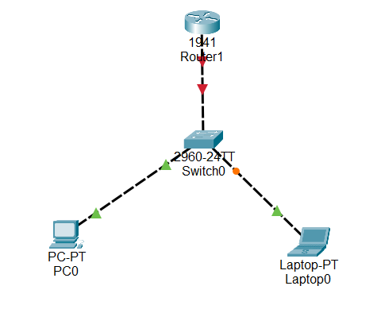

Segmentación de Red con VLSM (IPv4)
Vamos a partir de la red 192.168.0.0/24, que dispone de 256 direcciones IP posibles. Si necesitamos crear 5 grupos de trabajo sin desperdiciar direcciones, lo ideal es usar VLSM (Máscara de Subred de Longitud Variable).

🔢 Cálculo de direcciones necesarias por subred
Para determinar cuántos bits debemos reservar para los hosts, usamos esta lógica:

Buscamos la menor potencia de 2 que cubra los hosts deseados.

`2^n ≥ número de hosts requeridos`

Por ejemplo:

`2² = 4 es muy justo`

`2³ = 8 es suficiente`

Esto indica que necesitaremos 3 bits para los hosts, lo que nos deja con 8 IPs por subred, de las cuales 6 son útiles (una es la red y otra el broadcast).

### Nueva Máscara
Como usamos 3 bits para hosts, restamos eso a los 32 bits totales:

32 - 3 = 29 bits para red

Pero partimos de /24, así que sumamos esos 3 a la máscara base:

/27 = 255.255.255.224

### Cálculo de direcciones de red y broadcast

Cuando se divide una red en subredes más pequeñas, es fundamental identificar correctamente la dirección de red y la dirección de broadcast. Estas marcan el inicio y el final de cada subred.

La dirección de red se obtiene asignando cero a todos los bits del campo de host.

La dirección de broadcast se obtiene asignando uno a todos los bits del campo de host.

Esto nos permite determinar el rango de direcciones disponibles para los hosts en cada subred.

Dirección de Red

En una máscara /27, los últimos 5 bits corresponden a la parte de host. Si colocamos todos estos bits en 0, obtenemos:

| Posición de bits  |     |     |     | /27 |    |    |    |    |
|-------------------|-----|-----|-----|-----|----|----|----|----|
| Valor del bit     | 128 |  64 |  32 |  16 |  8 |  4 |  2 |  1 |
| Bits utilizados   |  0  |  0  |  0  |  0  |  0 |  0 |  0 |  0 |

Dirección de red resultante: 192.168.0.0
Esta dirección identifica a la subred y no debe asignarse a ningún host.

Dirección de Broadcast
Si colocamos unos en los mismos 5 bits de host:

| Posición de bits  |     |     |     | /27 |    |    |    |    |
|-------------------|-----|-----|-----|-----|----|----|----|----|
| Valor del bit     | 128 |  64 |  32 |  16 |  8 |  4 |  2 |  1 |
| Bits utilizados   |  0  |  0  |  0  |  1  |  1 |  1 |  1 |  1 |

Dirección de broadcast resultante: 192.168.0.31
Esta es la última dirección de la subred, utilizada para enviar mensajes a todos los dispositivos dentro de ella. Tampoco se asigna a un host.

#### Primera Subred:

- Dirección de red: `192.168.0.0`
- Primer host válido: `192.168.0.1`
- Último host válido: `192.168.0.30`
- Dirección de broadcast: `192.168.0.31`

IPs utilizables:  
`192.168.0.1` → `192.168.0.30`

## Configuraciones 

### Segmento de red

parte de la: 172.16.0.32

hasta la: 172.16.0.63

Las direcciones IP utilizables son desde la:

172.16.0.33

hasta la:

172.16.0.62

Dirección IPv6 global:

2001:db8:1:b::/64

Dirección IPV6 local:

FE80::/10

### Direcciones IP de dispositivos

Direcciones IPV4 e IPv6  para conexión de los dispositivos a implementar:

IPv4 Switch: 172.16.0.62

Mascara de subred: 255.255.255.224

IPv6 gloabl Switch:  2001:db8:1:b::2

IPv6 local Switch: FE80::2 

IP  Router: 172.16.0.61

IPv6 global Router: 2001:db8:1:b::1

IPv6 local: FE80::1

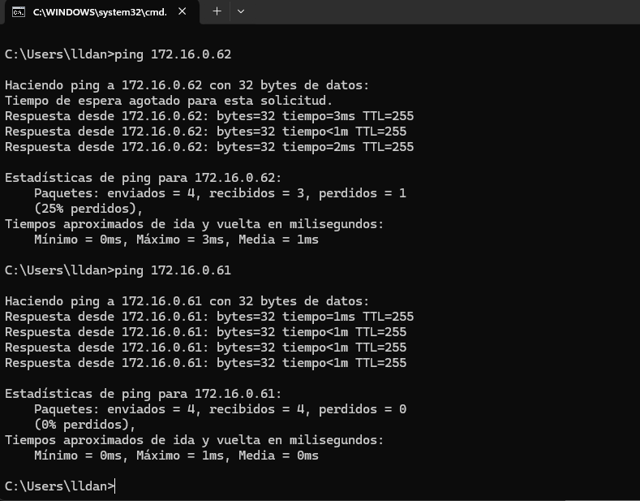

**PC Servidor** 

IPv4= 172.16.0.34

mascara= 255.255.255.224

Ipv6 global servidor: 2001:db8:1:b::3 

**PC1 Cliente**

IPv4= 172.16.0.35

mascara=255.255.255.224

IPv6 global Cliente PC1: 2001:db8:1:b::4

**PC2 Cliente**

IPv4=172.16.0.36

mascara=255.255.255.224

IPv6 global cliente PC2: 2001:db8:1:b::5

### Topología de conexión (Redes)

Esta es la topología a implementar para realizar las conexiones de red del proyecto; se usa un router, switch, un router, una laptop servidor y dos laptops clientes

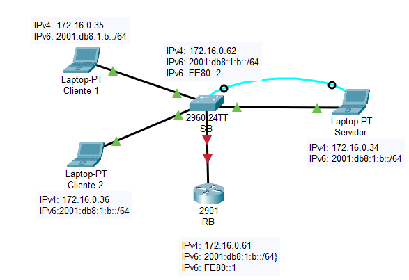

## Configuraciones Básicas de Switch

Estas son las configuraciones necesarias para el funcionamiento del switch en la topología:

Switch>enable  
Switch#config t  
Switch(config)#sdm prefer dual-ipv4-and-ipv6 default  
Switch(config)#end  
Switch#reload

Switch>enable  
Switch#configure terminal  
Switch(config)#hostname SB  
SB(config)#enable password cisco  
SB(config)#enable secret tics  
SB(config)#banner motd "Configuraciones de SB"  

SB(config)#line vty 0 15  
SB(config-line)#password telnet  
SB(config-line)#login  
SB(config-line)#exit  

SB(config)#line console 0  
SB(config-line)#password consola  
SB(config-line)#login  
SB(config-line)#exit  

SB(config)#service password-encryption      // No escriptar  
SB(config)#ip domain-name cisco.com         // Establece un nombre de dominio  
SB(config)#username admin password admin  
SB(config)#crypto key generate rsa          // Genera claves RSA necesarias para SSH

The name for the keys will be: RB.cisco.com  
Choose the size of the key modulus in the range of 360 to 4096 for your  
  General Purpose Keys. Choosing a key modulus greater than 512 may take a few minutes.  

How many bits in the modulus [512]: 1024  
Generating 1024 bit RSA keys, keys will be non-exportable... [OK]  

SB(config)#line vty 0 15  
SB(config-line)#transport input telnet ssh     // Acepta conexiones Telnet y SSH  
SB(config-line)#login local  
SB(config-line)#exit  

SB#reload

## Configuraciones Basicas de Router

Estas son las configuraciones necesarias para el funcionamiento del router en la topología:

Switch>enable  
Switch#configure terminal  
Switch(config)#hostname SB  
SB(config)#enable password cisco  
SB(config)#enable secret tics  
SB(config)#banner motd "Configuraciones de SB"  

SB(config)#line vty 0 15  
SB(config-line)#password telnet  
SB(config-line)#login  
SB(config-line)#exit  

SB(config)#line console 0  
SB(config-line)#password consola  
SB(config-line)#login  
SB(config-line)#exit  

SB(config)#interface vlan 1  
SB(config-line)#ip address 172.16.0.62 255.255.255.224  
SB(config-line)#ipv6 address 2001:db8:1:b::/64 eui-64  
SB(config-line)#ipv6 address FE80::2 link-local  
SB(config-line)#no shutdown   // Sirve para habilitar o activar una interfaz que está administrativamente apagada por defecto  
SB(config-line)#description "toAdmin"  
SB(config-line)#exit  

SB(config)#service password-encryption  
// No escribir  
SB(config)#ip domain-name cisco.com   // Establece un nombre de dominio predeterminado  
SB(config)#username admin password admin  
SB(config)#crypto key generate rsa    // Genera un par de claves RSA necesarias para habilitar funciones de seguridad  

The name for the keys will be: RB.cisco.com  
Choose the size of the key modulus in the range of 360 to 4096 for your  
  General Purpose Keys. Choosing a key modulus greater than 512 may take a few minutes.  

How many bits in the modulus [512]: 1024  
Generating 1024 bit RSA keys, keys will be non-exportable... [OK]  

RB(config)#line vty 0 4  
RB(config-line)#transport input telnet ssh  
RB(config-line)#login local  
RB(config-line)#exit  

### Configuración para conexión PC

Ingresar al panel de control:

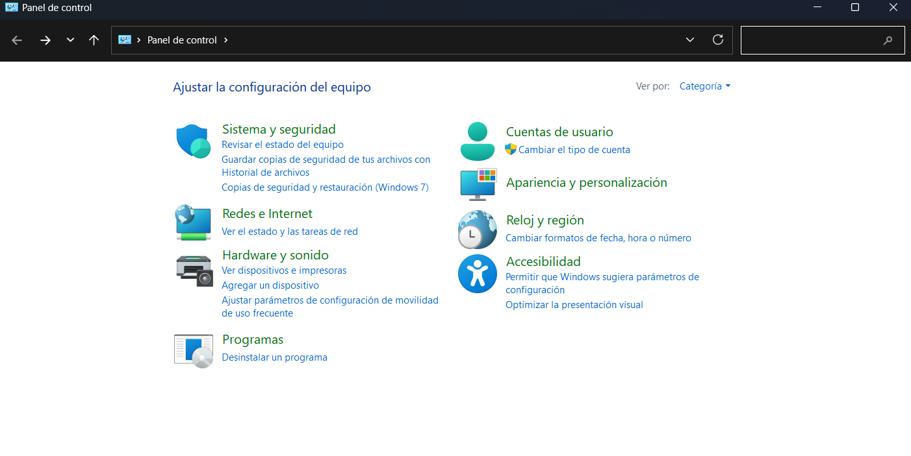

Seleccionar redes e internet:

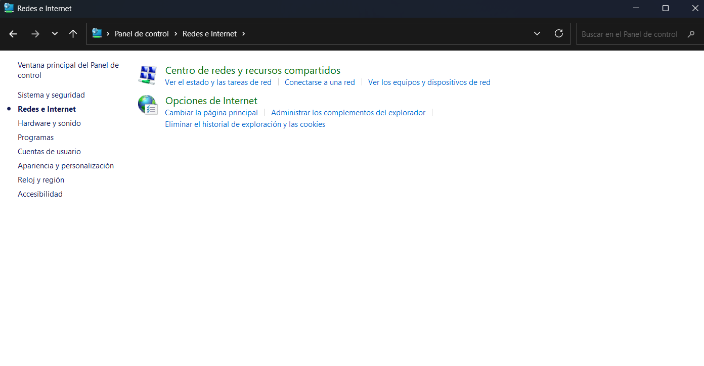

Seguidamente en centro de redes y recursos compartidos:

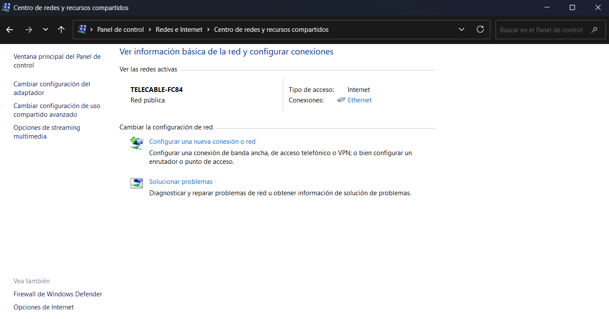

A continuación ingresamos a ethernet:

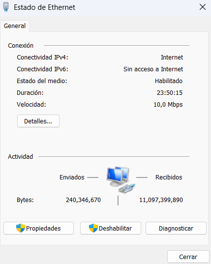

Luego en propiedades:

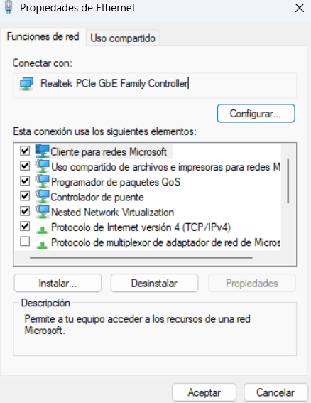

Seleccionamos 
El apartado protocolo de Internet versión 4(TCP/IPv4), e ingresas la IP 172.16.0.35 y su mascara: 255.255.255.224 
para la pc 1 y 172.16.0.36 y su mascara: 255.255.255.224 para la pc 2

Seguidamente seleccionamos el apartado de protocolo de Internet versión 6(TCP(IPv6), e ingresas la IP 2001:db8:1:b::4 
y el prefijo de 64 para la pc 1 y 2001:db8:1:b::5 y el prefijo de 64 para la pc 2

### Conexión mediante SSH al router via ipv6

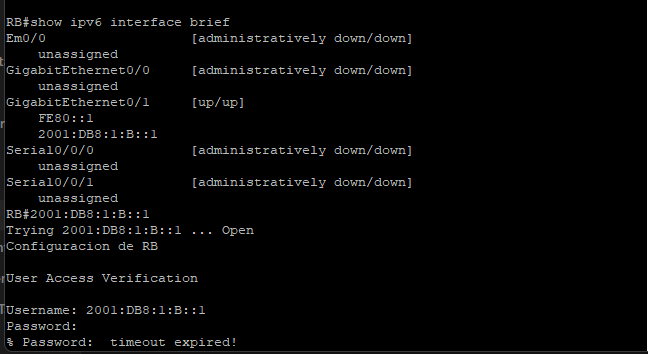

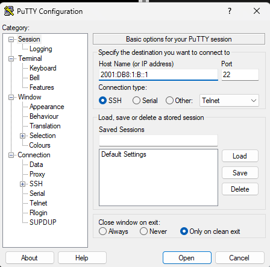

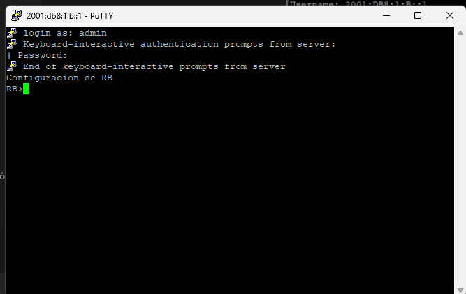
